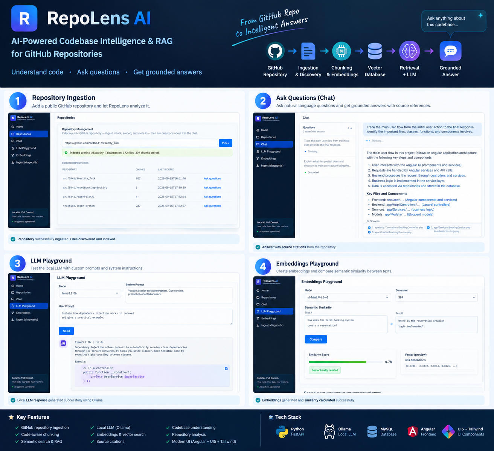

# RepoLens AI

Codebase intelligence and explainable RAG system. Index a public GitHub repository, ask questions about its source code, get answers grounded in retrieved code with file/line-level citations.



## How It Works

1. **Ingest** — paste a public GitHub URL at `/repositories`. RepoLens pulls the file tree via the GitHub API (no clone), filters out binaries/lockfiles/generated files.
2. **Chunk + Embed** — included files are split into function/class-level chunks, each turned into a vector by a local embedding model, and stored in MySQL.
3. **Ask** — at `/chat`, pick the indexed repo and ask a question in plain English.
4. **Retrieve + Rank** — your question is embedded too; RepoLens finds the most similar stored chunks by cosine similarity.
5. **Answer, grounded** — the top chunks are handed to a local LLM (Ollama) as context, with instructions to answer only from that evidence and cite it. If nothing relevant was found, it says so instead of guessing.
6. **Citations** — every answer links back to the exact file, line range, and real source snippet it came from — expand any citation to see it.

New to the project? Full click-by-click steps: [USER_MANUAL.md](USER_MANUAL.md). Full build history and what's honestly *not* built: [FEATURE.md](FEATURE.md).

## Status

**Working end to end — Phase 0 through Phase 11 implemented and verified** (Phase 12, public release polish, not started). RepoLens can index a real public GitHub repository and answer real questions about it, grounded in retrieved code with citations, refusing to guess when it doesn't have evidence. Some sub-capabilities are honestly incomplete — see [FEATURE.md](FEATURE.md) for exactly what is and isn't built (each phase lists concrete cuts, not just checkmarks).

**Try it**: index a repo at `/repositories` (or use the pre-loaded `trekhleb/learn-python` demo data if present), then ask about it at `/chat`.

## Problem

Understanding an unfamiliar codebase is slow. Grepping and manual reading don't surface cross-file relationships or intent. Generic LLM chat (paste-and-ask) hallucinates APIs and can't point to real code locations.

## Solution

RepoLens indexes a repository's source code into searchable, code-aware chunks (function/class-level via regex boundary detection, not arbitrary text splits), retrieves the most relevant chunks for a question via semantic search, and asks a local LLM to answer using only that retrieved evidence — citing exact file and line ranges, with the real source shown inline. When there isn't enough evidence, it says so instead of guessing — verified behavior, not just a design intention (see `rag_service.py`'s insufficient-evidence path).

## Features

- Index any public GitHub repository — no clone, no code execution, GitHub API only
- Code-aware chunking (function/class boundaries) with exact line tracking
- Local embedding generation + MySQL vector storage
- Semantic search over an indexed repository
- Grounded Q&A with citations and real source excerpts (`/chat`)
- Single-file code explanation (`/explain` API)
- A small real evaluation harness (`evaluation/eval_retrieval.py`) measuring retrieval hit rate and answer groundedness
- Enterprise-style Angular UI (SAP Fiori-inspired): dashboard, repository management, chat, plus diagnostic LLM/embeddings playgrounds

Full phased roadmap, including honest gaps (architecture analysis, doc generation, and a few other Phase 8-10 items not built): [FEATURE.md](FEATURE.md)

## Architecture

```text
Angular (Fiori-style UI)
   ↓
FastAPI
   ↓
Application Services
   ↓
RAG Pipeline (retrieve → rank → context → prompt → LLM)
   ↓
MySQL (app data + embeddings/chunks)
   ↓
Ollama (local LLM)
```

This is real now, not aspirational — `POST /api/v1/repositories/ask` runs exactly this path. Full architecture document, data flow, database design, and AI concept explanations (written for an engineer new to AI/ML): [docs/architecture/overview.md](docs/architecture/overview.md)

## Technology Stack

- **Backend**: Python, FastAPI, Pydantic, SQLAlchemy + Alembic, sentence-transformers, Ollama
- **Database**: MySQL
- **Frontend**: Angular, TypeScript, UI5 Web Components, Tailwind CSS

LangChain was deliberately **not** used — direct calls to Ollama/sentence-transformers were simpler and kept every pipeline step transparent. See [CLAUDE.md](CLAUDE.md) for full stack rationale and prohibited technologies.

## Free / Local-First Philosophy

RepoLens runs entirely on local, free/open-source models by default: Ollama for the LLM, a local embedding model for semantic search, MySQL for storage. No paid API key is required to use the core product. Any future optional paid provider would sit behind a provider abstraction and remain strictly opt-in.

## Installation

Requires: Python 3.11+, Node.js LTS, MySQL 8, and [Ollama](https://ollama.com).

```bash
git clone <repo-url> repolens-ai && cd repolens-ai
cp .env.example .env               # fill in your local MySQL credentials

python3 -m venv backend/.venv
backend/.venv/bin/pip install -r backend/requirements.txt

npm install --prefix frontend

curl -fsSL https://ollama.com/install.sh | sh   # if not already installed
ollama pull phi3:mini                            # default LLM model (see .env.example to change it)

cd backend && .venv/bin/alembic upgrade head && cd ..   # create the database schema

./run.sh                           # starts backend + frontend
```

The embedding model (`sentence-transformers/all-MiniLM-L6-v2`) downloads automatically on first use (~30s, one time).

Backend: http://localhost:8000/health · Frontend: http://localhost:4200

| Page | What it does |
|---|---|
| `/` | Dashboard — system status, recent repositories, quick actions |
| `/repositories` | **Main flow.** Index a GitHub repo, see what's indexed |
| `/chat` | **Main flow.** Ask questions about an indexed repo, grounded answers with citations |
| `/playground` | Diagnostic — raw LLM chat, no repository context. Debug: is Ollama/the model working at all? |
| `/embeddings` | Diagnostic — embedding + similarity only, nothing stored. Debug: does the similarity model behave sanely? |
| `/ingest` | Diagnostic — file discovery/filtering only, nothing stored. Debug: would this repo ingest cleanly before committing to a full index? |

Normal use only needs `/repositories` + `/chat`. The three diagnostic pages exist to test one pipeline stage in isolation when something upstream breaks — they don't save anything to the database.

**A note on speed**: this runs entirely on local CPU inference by default. A short LLM reply takes ~15s; a full grounded RAG answer with retrieved code context takes **~100-115s** on a CPU-only machine (no GPU). This is real, measured, and expected — the chat UI says so explicitly rather than hiding a long wait behind an unexplained spinner. Faster with a GPU-backed Ollama setup or a smaller/faster model.

## Evaluation

```bash
cd backend && .venv/bin/python ../evaluation/eval_retrieval.py
```

Indexes a real small repository (`trekhleb/learn-python`) and runs a curated question set against it, measuring retrieval hit rate and RAG answer groundedness/citation correctness for real — not a CI gate (takes a few minutes, does real LLM calls), a report you run and read.

## License

See [LICENSE](LICENSE).
